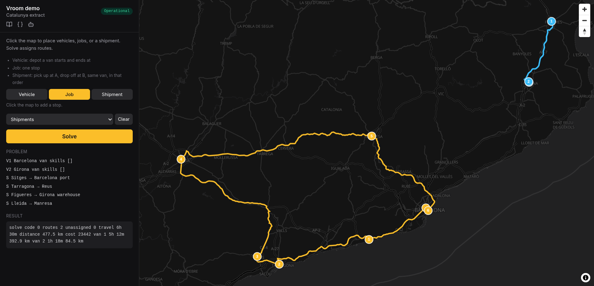

# Vroom Hono




A routing engine built with [VROOM](https://github.com/VROOM-Project/vroom), with an HTTP API and MCP server, with fully OpenAPI-compliant documentation. You post vehicles, jobs, and shipments. It returns routes. Travel times come from OSRM.


## How to run

```sh
docker compose up --build
```

The first build downloads the map and preprocesses it, so it takes a while.

Afterward you should see the demo page at <http://localhost:3000/demo>.


## Using it with an AI

Start the app as above. If you open this project in Cursor, you are already set. Just talk to the agent.

Tell it where the vehicles start, what they should pick up and drop off, and any time limits. Stick to Guatemala. Places outside that map will not work.

Example:

> Two vans start at Parque Central in Guatemala City. One picks up a pallet in Antigua and delivers it to Puerto San José. The other has three short jobs in Mixco. Keep each vehicle under 8 hours.

If you use another AI app, give it this address: <http://localhost:3000/mcp>

The [official MCP docs](https://modelcontextprotocol.io/docs/develop/connect-remote-servers) show how to plug an address like that into Claude and other apps.


## Changing the map

The default extract is Guatemala, hardcoded in `Dockerfile.Osrm`. To change region, pick a `.osm.pbf` from [Geofabrik](https://download.geofabrik.de/), then replace the wget URL and every `guatemala-latest` filename in extract, partition, customize, and the `CMD`. Rebuild after that.

Bigger extracts make a chunkier container: longer download, more RAM while OSRM builds the graph, and a heavier image to run.
